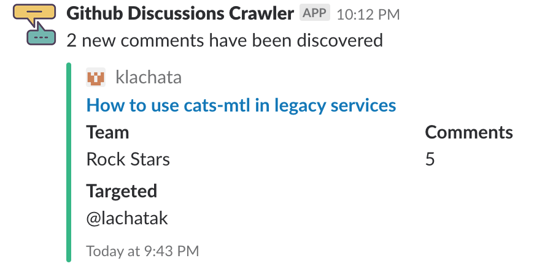

# Github Discussions Crawler and Slack Publisher [](https://circleci.com/gh/qualiton/github-discussions-crawler/tree/master) [](https://coveralls.io/github/qualiton/github-discussions-crawler?branch=convert_to_bot)

Using [Github Team Discussion](https://blog.github.com/2017-11-20-introducing-team-discussions/) is an excellent way of promoting team collaboration. It can be used for [Architecture Decision Records](https://www.thoughtworks.com/radar/techniques/lightweight-architecture-decision-records), team meeting memos, RFCs.

[Slack](https://slack.com/) is the best team collaboration tool out in the market. It excels with huge number of integration capabilities.

Github Discussions Crawler marries both of the worlds by publishing discussion events to a slack channel. It uses [Github API V3](https://developer.github.com/v3/) and [Slack Incoming Webhooks](https://api.slack.com/incoming-webhooks) for the integration.

## Supported events

- New discussion has been discovered

<a href="url"></a>

- New comment has been discovered

<a href="url"></a>

- Targeted message delivery

Both of the events extract targeted users and teams by scanning the message body for `@[0-9a-zA-Z_\-]+` or `#[0-9a-zA-Z_\-]+`.
Targeted teams are notified directly via the team channel if the bot is added as user to the targeted channel in Slack.

<a href="url"></a>

- Runs as Slack bot user
The app uses Slack's RTM api which gives event driven capabilities to the service

## Prerequisites

- Kubernetes cluster with helm/tiller installed
- Postgres SQL database to store Github discussion details
- [Github API token](https://help.github.com/articles/creating-a-personal-access-token-for-the-command-line/) with `read:discussion  Read team discussions` and `read:org  Read org and team membership, read org projects` permission for an account which is member of the discussion we would like to have updates from
- [Slack Bot User](https://api.slack.com/bot-users) for Github Discussions Crawler

## Installing the Chart

The chart itself is stored in this github repository in the `gh-pages` branch.
To be able to use it with `helm` you have to add this chart repository to `helm` repository list.

```bash
helm repo add qualiton https://qualiton.github.io/github-discussions-crawler/
```
> **Tip**: verify if helm sees the added chart repository `helm search github-discussions-crawler`

Install from remote URL with the release name `github-discussions-crawler` into namespace `github-discussions-crawler` by specifing each parameter using the `--set key=value[,key=value]` argument to `helm upgrade `:

```bash
helm upgrade github-discussions-crawler qualiton/github-discussions-crawler \
	--set github.api_token=GITHUB_API_TOKEN \
	--set slack.api_token=SLACK_API_TOKEN \
	--set slack.default_publish_channel=SLACK_CHANNEL \
	--set database.jdbc_url=DATABASE_JDBC_URL \
	--set database.username=DATABASE_USERNAME \
	--set database.password=DATABASE_PASSWORD \
	--install --wait
```

Alternatively, a YAML file that specifies the values for the above parameters can be provided while installing the chart. For example,

```bash
helm upgrade github-discussions-crawler qualiton/github-discussions-crawler -f values.yaml --install --wait
```

`values.yaml` should contain every mandatory attributes to be able to populate the k8s secrets.

## values.yaml format

```yaml
github:
  api_token: GITHUB_API_TOKEN
slack:
  api_token: SLACK_API_TOKEN
  default_publish_channel: SLACK_CHANNEL
database:
  jdbc_url: JDBC_URL
  username: USERNAME
  password: PASSWORD
```

## Running directly from the docker image

The simples way to run it is to provide a `docker-compose.yaml` file and run it with `docker-compose up`

```yaml
version: '2'

services:
  postgres:
    image: postgres:9.6-alpine
    environment:
      POSTGRES_PASSWORD: "postgres"
    ports:
    - "5432:5432"
  crawler-service:
    image: lachatak/github-discussions-crawler:latest
    depends_on:
    - postgres
    environment:
      GITHUB_API_TOKEN: "GITHUB_API_TOKEN"
      SLACK_API_TOKEN: "SLACK_API_TOKEN"
      SLACK_DEFAULT_PUBLISH_CHANNEL: "gd-test"
      DATABASE_JDBC_URL: "jdbc:postgresql://postgres:5432/postgres"
      DATABASE_USERNAME: "postgres"
      DATABASE_PASSWORD: "postgres"
    ports:
    - "9000:9000"
```

## Uninstalling the Chart

To uninstall/delete the `github-discussions-crawler` deployment:

```bash
helm delete --purge github-discussions-crawler
```

The command removes all the Kubernetes components associated with the chart and deletes the release.

## Running with GCP SQL

To be able to run with GCP SQL you have to install [gcloud-sqlproxy](https://github.com/helm/charts/tree/master/stable/gcloud-sqlproxy) and configure the Crawler database settings to point to the gcloud-sqlproxy.

Assuming that you already set the following:

- Google Service Account with `Cloud SQL Client` role and furnished the key
- Created a Google SQL instance with `gd-crawler-db` database name and `gd-crawler-user` database user name
- You intent to use default settings for the `pg-sqlproxy`

```bash
helm upgrade github-discussions-crawler qualiton/github-discussions-crawler \
	--set github.api_token=GITHUB_API_TOKEN \
	--set slack.api_token=SLACK_API_TOKEN \
	--set slack.default_publish_channel=git-discussions \
	--set database.jdbc_url=jdbc:postgresql://pg-sqlproxy-gcloud-sqlproxy.github-discussions-crawler:5432/gd-crawler-db \
	--set database.username=gd-crawler-user \
	--set database.password=DATABASE_PASSWORD \
	--install --wait
```
The Crawler will be restarted by Kubernetes since it cannot connect to the Cloud SQL but as soon as you install the proxy into namespace `github-discussions-crawler` the app will just start working.

```bash
helm upgrade pg-sqlproxy stable/gcloud-sqlproxy --namespace github-discussions-crawler \
  	--set serviceAccountKey="$(cat service-account.json | base64)" \
  	--set "cloudsql.instances[0].instance"=INSTANCE \
  	--set "cloudsql.instances[0].project"=PROJECT \
  	--set "cloudsql.instances[0].region"=REGION \
  	--set "cloudsql.instances[0].port"=5432 \
  	--install --wait
```

## Future improvements

- Send personalised slack message to individuals and/or teams
- Integrate with [Github Reactions Api](https://developer.github.com/v3/reactions/)
- Add more event types like `Discussion has been closed`, `Comment body has changed`
- Add query capabilities for stats

## Documentation

- [Github Team Discussion](https://blog.github.com/2017-11-20-introducing-team-discussions/)
- [Github API token](https://help.github.com/articles/creating-a-personal-access-token-for-the-command-line/)
- [Slack Incoming Webhooks](https://api.slack.com/incoming-webhooks)
- [Cloud SQL Proxy for Postgres](https://cloud.google.com/sql/docs/postgres/sql-proxy)
